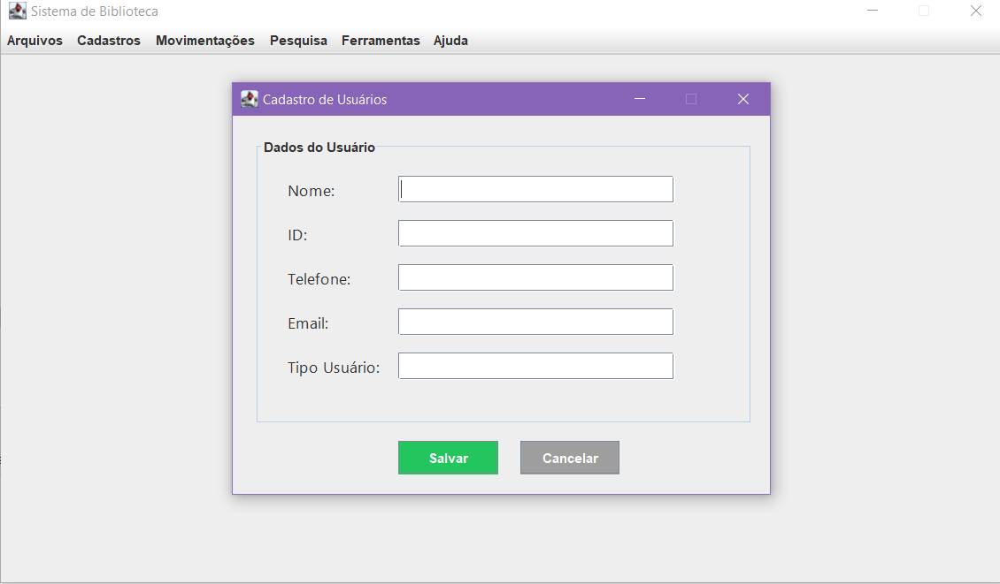
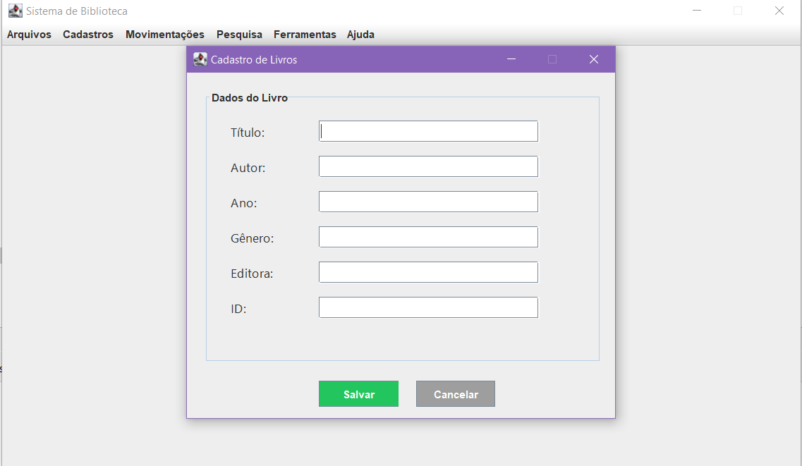
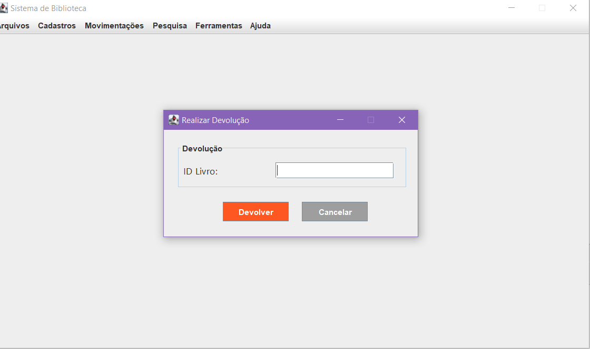

# 📚 Sistema de Gerenciamento de Biblioteca (Swing)

Este projeto consiste em um **sistema de biblioteca desenvolvido em Java com interface gráfica Swing**.  
O objetivo é simular o gerenciamento de usuários, livros e operações como empréstimo e devolução, com foco em **estruturação de código, orientação a objetos e construção de interfaces gráficas**.

> ⚠️ Projeto acadêmico. Algumas funcionalidades podem não estar totalmente integradas ao backend.

---

## 🎯 Objetivo do Projeto
- Praticar **Java Orientado a Objetos**
- Desenvolver interfaces gráficas com **Java Swing**
- Organizar um sistema com múltiplas funcionalidades
- Aplicar conceitos como classes, encapsulamento e modularização

---

## 🧩 Funcionalidades do Sistema

### 👤 Cadastro de Usuário
Permite o registro de usuários no sistema, armazenando informações básicas necessárias para o uso da biblioteca.

 

---

### 📘 Cadastro de Livro
Tela destinada ao cadastro de livros, com informações como título, autor e código identificador.



---

### 🔄 Empréstimo de Livro
Funcionalidade responsável por realizar o empréstimo de livros aos usuários cadastrados.


---

### 📥 Devolução de Livro
Permite registrar a devolução de livros emprestados anteriormente.



---

### 🗂️ Arquivos
Área destinada à visualização e organização de registros ou dados do sistema.


---

### 🧰 Ferramentas
Conjunto de opções auxiliares para gerenciamento do sistema.
 
 

---

### ❓ Ajuda
Tela de suporte ao usuário, com instruções básicas de uso do sistema.


---

## 🛠️ Tecnologias Utilizadas
- Java
- Java Swing
- NetBeans / IntelliJ IDEA
- Programação Orientada a Objetos (POO)

---

## ▶️ Como Executar o Projeto

1. Clone este repositório:
```bash
git clone https://github.com/seu-usuario/nome-do-repositorio.git
